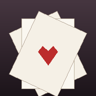

<p align="center">
  
</p>

<h1 align="center">Seclusa Solitaire</h1>

<p align="center">
  <em>Seclusa — from the Latin meaning "private", "secluded", or "set apart"</em>
</p>

<p align="center">
  <em>A privacy-first solitaire collection for Android — zero tracking, no accounts, no ads.</em>
</p>

<p align="center">
  <em>Seclusa Solitaire is a fork of <a href="https://github.com/TobiasBielefeld/Simple-Solitaire">Simple Solitaire Collection</a> by Tobias Bielefeld, modified according to the GPL.</em>
</p>

<p align="center">
  <a href="LICENSE.txt"></a>
  <a href="https://github.com/ambr3/Seclusa-Solitaire/commits/master"></a>
  
  
</p>

<p align="center">
  <a href="#features">Features</a> ·
  <a href="#privacy">Privacy</a> ·
  <a href="#installation">Installation</a> ·
  <a href="#license">License</a>
</p>

---

Keeps your cards your own. Seclusa Solitaire is a **fully offline, open-source Android solitaire collection**. It asks for **zero permissions**, makes **no network requests**, and runs entirely on your device. No accounts, no ads, no tracking — just privacy-first card games.

---

## ✨ Features

### 🃏 Games
- **19 solitaire variants** — AcesUp, Calculation, Canfield, Forty&Eight, FreeCell, Golf, Grandfather's Clock, Gypsy, Klondike, Maze, Mod3, Napoleon's Tomb, Pyramid, SimpleSimon, Spider, Spiderette, TriPeaks, Vegas and Yukon
- **Auto-saving** — your current game is saved when you pause or close the app
- **Undo & hints** — undo up to 20 card movements, with a hint function that shows possible moves
- **High scores** — the top 10 scores are saved in a statistics list

### 🎨 Interface
- **Highly customizable** — 10 card themes, 10 card backgrounds, and 4 background colours
- **Difficulty settings** — for Klondike, Spider, and Golf
- **Left-handed mode** — mirror the card positions to the left side
- **Landscape & tablet support** — with the option to lock orientation
- **Tap to move or drag & drop** — your choice of controls

---

## 🔒 Privacy

Your data is your business. That's the whole point.

| | |
|---|---|
| 🚫 **Zero permissions** | The app requests no permissions at all — no internet, location, or storage |
| 🚫 **No network** | The code makes no network requests — it cannot send your data anywhere |
| 🚫 **Zero tracking** | No analytics, no ads, no third-party SDKs |
| 🏠 **Stays on device** | Game state and scores live only on your device's storage |
| 🧽 **No Google backup** | Google's automatic app-data backup is disabled |
| 📜 **Open source** | GPL-3.0 — read every line |

---

## 📦 Installation

### Via APK

Download the signed APK from the [Releases page](https://github.com/ambr3/Seclusa-Solitaire/releases) and install it on your device.

To verify the APK is signed by this project, check the signing certificate. It must match the SHA-256 fingerprint below:

```
ee9572ee718afb5df1883d9ad27d1c0ced367ab54e3fb04a08aabc80ee05b766
```

On a machine with the Android build-tools installed, run:

```
apksigner verify --print-certs Seclusa-Solitaire-v4.0.1-android17.apk
```

The output's `Signer #1 certificate SHA-256 digest` should match the fingerprint above.

### VirusTotal scan

The v4.0.1 APK was scanned by [VirusTotal](https://www.virustotal.com/gui/file/41b29921b2da4da38f0eeb1c5dc45c2898c8506f1179f163e210b118da3c5c31) — **no security vendors flagged it as malicious**.

File SHA-256: `41b29921b2da4da38f0eeb1c5dc45c2898c8506f1179f163e210b118da3c5c31`

You can re-check anytime — virus scanners are updated constantly, so a fresh scan is more meaningful than this snapshot.

### Build it yourself

Install [Android Studio](https://developer.android.com/studio), open the project folder, and press **Run**:

1. Clone or download this repo
2. Open the folder in Android Studio
3. Let Gradle sync
4. Press the green **Run ▶** button
5. Done — install it on your phone or emulator as an APK

> 🗓️ **Maintenance note:** Google releases a new Android version (and target SDK) about once a year, so the target SDK is bumped on that same cadence. Bug fixes can come out sooner, on their own. Updates are otherwise intentionally conservative — this app requests zero permissions and has no dependencies that force frequent version bumps.

---

## ⚠️ Disclaimer

> This project is a fork of [Simple Solitaire](https://github.com/TobiasBielefeld/Simple-Solitaire). The fork is **vibe-coded** — built with AI assistance. I am not a professional developer, so I may have missed something. Audit it yourself before use, especially if self-hosting or modifying. Use at your own risk.

---

## 📄 License & Credits

**Seclusa Solitaire** is a fork of **Simple Solitaire Collection** by Tobias Bielefeld, modified according to the GPL.

- Simple Solitaire Collection — https://github.com/TobiasBielefeld/Simple-Solitaire
- Copyright 2016 – Tobias Bielefeld – tobias.bielefeld@gmail.com
- Licensed under GPLv3+ https://www.gnu.org/licenses/gpl-3.0

**Changes made in this fork:**
- Forked into *Seclusa Solitaire* (v4.0.1, versionCode 401) with its own app ID (`com.ambr3.seclusasolitaire`)
- Updated the target SDK to 37 (Android 17) — further SDK bumps are done roughly once a year, or sooner if a bug fix needs it
- Updated the Gradle/AGP build files to compile with modern Android Studio (AGP 9.3)
- Disabled Google's automatic app-data backup for privacy
- Replaced the card-shuffle RNG with `SecureRandom`
- Removed developer/cheat options (instant win, play every card, etc.) from release builds
- Fixed handler memory leaks on screen rotation
- Deleted unused code and resources
- New launcher icon and re-styled README

[GPL-3.0](LICENSE.txt) — free to use, modify, and share, with the same freedom preserved for derivatives.

---