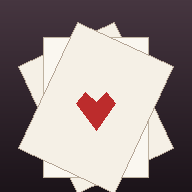
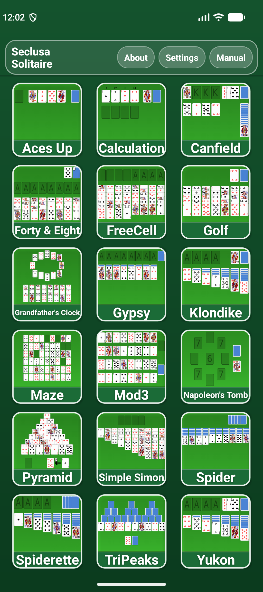
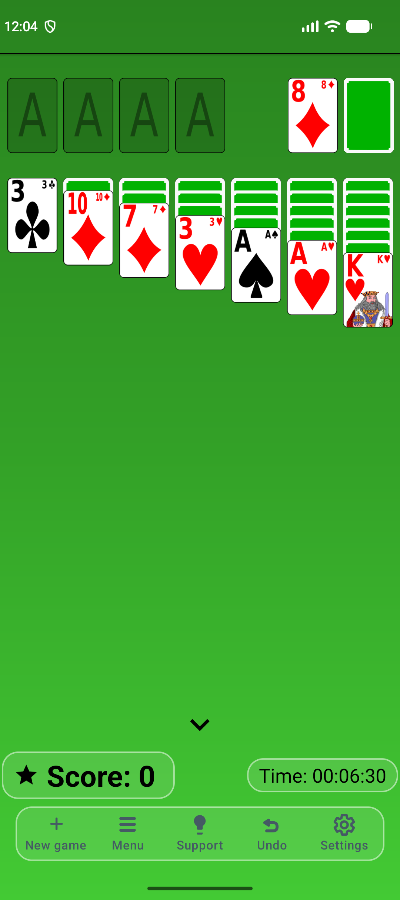
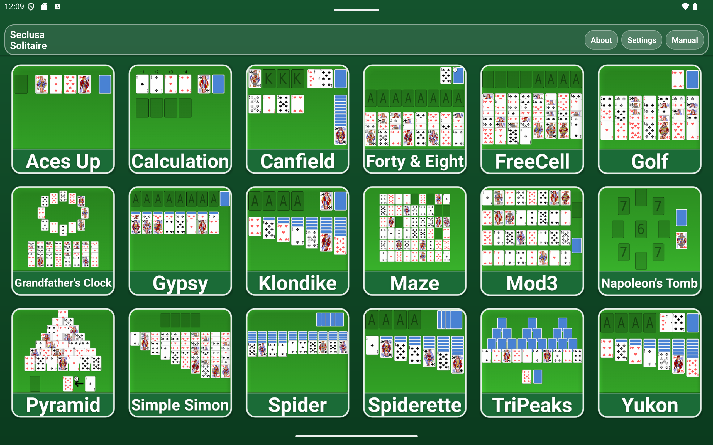
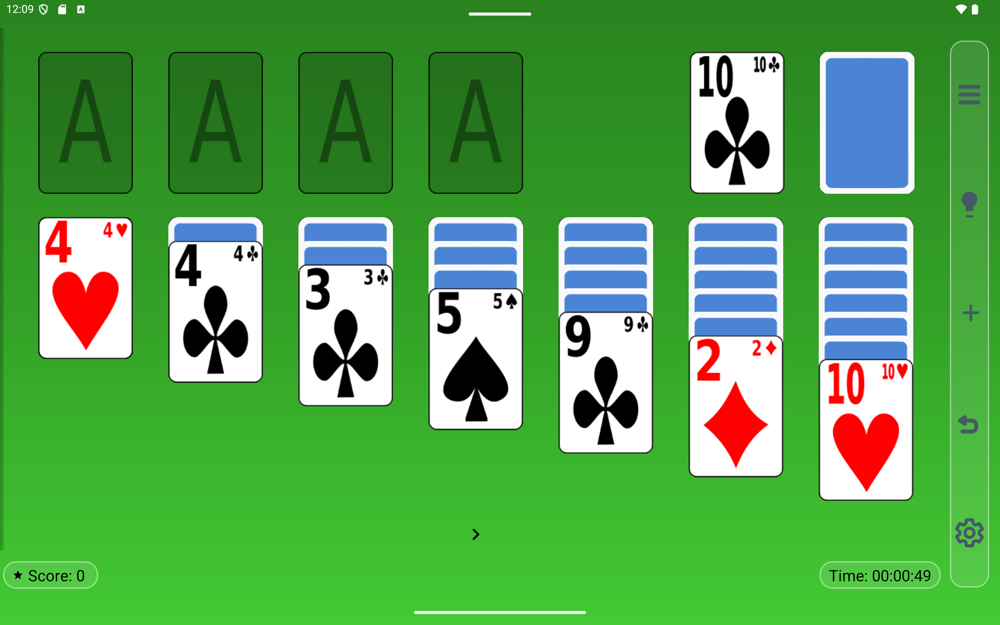

<p align="center">
  
</p>

<h1 align="center">Seclusa Solitaire</h1>

<p align="center">
  <em>Privacy-first solitaire for Android — zero tracking, no accounts, no ads.</em><br>
  <em>Seclusa — from the Latin for “private”, “secluded”, “set apart”.</em>
</p>

<p align="center">
  <a href="LICENSE.txt"></a>
  <a href="https://github.com/ambr3/Seclusa-Solitaire/commits/master"></a>
  
  
</p>

<p align="center"><strong>v4.3.6</strong></p>

<p align="center">
  
  
  
  
</p>

---

Fork of [Simple Solitaire Collection](https://github.com/TobiasBielefeld/Simple-Solitaire) by Tobias Bielefeld (GPL). Modernised for Material 3 and a hard privacy bar: **no permissions, no network, no ads, no analytics**.

### A note from me

I’m not a professional Android developer. *[read more about me here](https://ambr3.pages.dev/#about)*. I’ve used AI while modernising this and I want to be transparent about that. I forked it because I played Simple Solitaire daily after it was archived, and I wanted something safer and more private. Audit the code before you rely on it. Everything is GPL-3.0 and open to review.


## Features

- **18 games** — Aces Up, Calculation, Canfield, Forty & Eight, FreeCell, Golf, Grandfather’s Clock, Gypsy, Klondike, Maze, Mod3, Napoleon’s Tomb, Pyramid, Simple Simon, Spider, Spiderette, TriPeaks, Yukon
- Auto-save, undo, hints, high scores
- Material 3 themes (Green default, Deep Orange, Blue, Purple) + system dark mode + dynamic colour on Android 12+
- Card themes, backgrounds, playfield colours, difficulty, left-handed mode, landscape & tablet

## Privacy

- **Zero permissions** — no internet, location, or storage
- **No network** — the app cannot phone home
- **On-device only** — scores and game state stay private; Android backup / D2D transfer disabled
- About attribution links open in the browser **only if you tap them**

## Install

<p align="center">
  <a href="https://ambr3.github.io/seclusa-fdroid/fdroid/repo?fingerprint=2462DF4F9948237CB60596149114523606EDA87C9BB72DB14CF3852ED4B4D33B"></a>
  &nbsp;
  <a href="https://apps.obtainium.imranr.dev/redirect?r=obtainium://app/%7B%22id%22%3A%20%22com.ambr3.seclusasolitaire%22%2C%20%22url%22%3A%20%22https%3A%2F%2Fgithub.com%2Fambr3%2FSeclusa-Solitaire%22%2C%20%22author%22%3A%20%22ambr3%22%2C%20%22name%22%3A%20%22Seclusa%20Solitaire%22%2C%20%22preferredApkIndex%22%3A%200%2C%20%22additionalSettings%22%3A%20%22%7B%5C%22includePrereleases%5C%22%3A%20false%2C%20%5C%22fallbackToOlderReleases%5C%22%3A%20true%2C%20%5C%22autoApkFiltering%5C%22%3A%20true%2C%20%5C%22appName%5C%22%3A%20%5C%22Seclusa%20Solitaire%5C%22%7D%22%7D"></a>
  &nbsp;
  <a href="https://github.com/ambr3/Seclusa-Solitaire/releases"></a>
</p>

<details>
<summary>F-Droid repo URL (with fingerprint)</summary>

```
https://ambr3.github.io/seclusa-fdroid/fdroid/repo?fingerprint=2462DF4F9948237CB60596149114523606EDA87C9BB72DB14CF3852ED4B4D33B
```

</details>

Signing certificate SHA-256:

```
ee9572ee718afb5df1883d9ad27d1c0ced367ab54e3fb04a08aabc80ee05b766
```

## Security

Each release is scanned with [MobSF](https://github.com/MobSF/Mobile-Security-Framework-MobSF) and [VirusTotal](https://www.virustotal.com/). Latest: [`security/mobsf-4.3.6.pdf`](security/mobsf-4.3.6.pdf) — **85/100, grade A**; [`security/virustotal4.3.6.pdf`](security/virustotal4.3.6.pdf) — **no vendors flagged malicious**.

MobSF may still flag RNG / log calls — **false positives** after minify: shuffling uses `SecureRandom`, and release builds strip `android.util.Log`. Domain strings in reports are About links only (tap to open); there is no `INTERNET` permission.

## What’s different in this fork

- Material 3 (DayNight, four palettes, dynamic colour), new icon, edge-to-edge layout
- Own app ID (`com.ambr3.seclusasolitaire`), zero permissions, backup off, non-exported activities, cleartext blocked
- `SecureRandom` shuffle; cheat/dev options removed from release; ProGuard minify + log strip
- Vegas betting mode removed (no gambling UI, even fictional)
- Target SDK 37; signed APKs named `Seclusa-Solitaire-v<version>-android17.apk`

See [CHANGELOG.md](CHANGELOG.md) for release notes.

## License

GPL-3.0 — see [LICENSE.txt](LICENSE.txt).

- Upstream: [Simple Solitaire Collection](https://github.com/TobiasBielefeld/Simple-Solitaire) — Tobias Bielefeld
